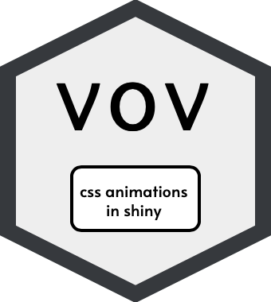

<!-- README.md is generated from README.Rmd. Please edit that file -->

vov 
==================================================================

<!-- badges: start -->

<!-- badges: end -->

The goal of vov is to wrap
[vov.css](https://github.com/vaibhav111tandon/vov.css) into functions so
they can be called on when developing a shiny application. Try out the
demo [here](https://tylerlittlefield.com/shiny/tyler/vov/) or check out
the original [here](https://vaibhav111tandon.github.io/vov.css/) by
Vaibhav Tandon. Alternatively, you can run a local copy with
`vov::run_demo()`.

Installation
------------

Install the released version of `vov` from CRAN:

    install.packages("vov")

Or install the development version from GitHub with:

    # install.packages("devtools")
    devtools::install_github("tylurp/vov")

Usage
-----

You can use `vov` in a shiny app like so:

    library(shiny)
    library(vov)

    ui <- fluidPage(
      use_vov(),
      swivel_vertical(
        h1("hello world!")
      )
    )

    server <- function(input, output, session) {

    }

    shinyApp(ui, server)

Where `swivel_vertical(h1("fade_in_bottom_left"))` returns:

    x <- swivel_vertical(h1("hello world!"))
    print(x)
    #> <h1 class="vov swivel-vertical">hello world!</h1>

If you don’t want to load this package, go to the original repo
[here](https://github.com/vaibhav111tandon/vov.css), download the CSS
file, and write something like this in your UI code:

    includeCSS("www/vov.css")
    htmltools::tagAppendAttributes(h1("hello world"), class = "vov swivel-vertical")
